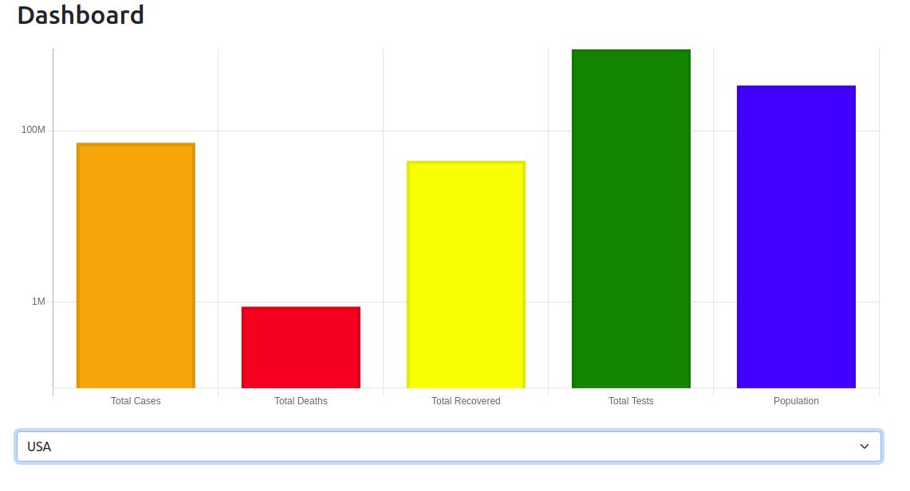

## Covid Dashboard




Linux:
```
Configure environment variables with one of the URL's below

Heroku:

https://covid-data-2022.herokuapp.com

Rapid API:

https://covid-data8.p.rapidapi.com/api

You can check my API and get all the endpoints on:

https://rapidapi.com/bolivarlagos/api/covid-data8/

```
